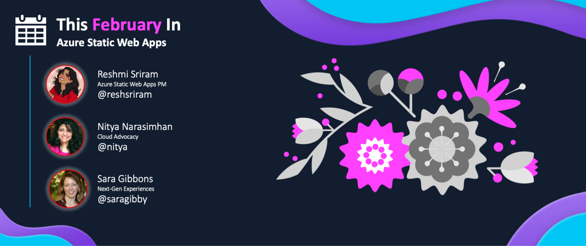

<head>
  <meta name="twitter:url" content="https://www.azurestaticwebapps.dev/blog/roundup-2023-feb" />
  <meta name="twitter:title" content="This Month in Azure Static Web Apps: Feb 2023" />
  <meta name="twitter:description" content="This February in @AzureStaticApps - we cover Azure Static Web Apps Diagnostics, authentication, deploying from Codespaces and SWA CLI" />
  <meta name="twitter:image" content="https://www.azurestaticwebapps.dev/img/png/roundup/feb.png" />
  <meta name="twitter:card" content="summary_large_image" />
  <meta name="twitter:creator" content="@nitya" />
  <meta name="twitter:site" content="@AzureStaticApps" /> 
  <link rel="canonical" href="https://www.azurestaticwebapps.dev/thismonth/roundup-2023-feb" />
</head>

Welcome to the **February 2023** edition of **This Month in SWA** 🎉

:::info ABOUT THE ROUNDUP 

The roundup is traditionally published **on the last Monday of each month** - just ahead of the [**Azure Static Web Apps Community Standup**](https://www.youtube.com/playlist?list=PLI7iePan8aH7Yo8vo288dAULgjyCCCcEJ) held on the last Wednesday of each month. Catch up on all the news and announcements in one friendly blog post, then join the livestream for interactive discussions, demos and more.

 * Want to make sure you don't miss the next roundup? <a href="/thismonth/rss.xml" target="_blank">**Subscribe to the feed**</a>.
 * Want to contribute items for roundup? [**Submit this custom issue**](https://github.com/staticwebdev/30DaysOfSWA/issues/new?assignees=&labels=ThisMonthIn+-+Community&template=---this-month-in-swa--community-submission.md&title=This+Month+In%3A+Community).
 * Want to catch up on past posts? [**Browse past editions.**](/roundup#roundups-archive)
 * Want to catch up on past livestreams? [**Watch standup recordings**](https://aka.ms/swa/community/standups)

And don't forget to contribute _your_ updates for inclusion in the next issue!

:::

---

---

## Product News

_This section covers recent news or announcements from the product team. Read on to learn the latest news from the world of Azure Static Web Apps!_ 

* **Feb 15** | [Public preview: Python 3.10 Support](https://azure.microsoft.com/updates/public-preview-python-310-support/?WT.mc_id=javascript-74011-ninarasi) By using Python 3.10 for your app, you can leverage the latest language and runtime improvements in Python. To use Python 3.10 in your Azure functions, please use [Functions version 4.x](https://learn.microsoft.com/azure/azure-functions/functions-versions?tabs=v4&pivots=programming-language-python&WT.mc_id=javascript-74011-ninarasi).
Azure Static Web Apps support for Python 3.10 follows the Python 3.10 lifecycle. | _**[Read More For Details!](https://aka.ms/swa-language-runtime)**_

* **Jan 26** | [Welcome to Azure Static Web Apps Community Standups!](https://youtu.be/7hTQJs9Ku5Y?list=PLI7iePan8aH7Yo8vo288dAULgjyCCCcEJ&t=143/?WT.mc_id=javascript-74011-ninarasi) This is a monthly livestream covering news, demos and product updates! In the first edition of the SWA Community Standup, you'll get to meet the team, learn more about the product, explore community resources, and see quickstart demos with your favorite developer tooling! | _**[Bookmark The Playlist!](https://aka.ms/swa/community/standups)**_

---

## Dev Resources

_This section covers content, events and code samples from Microsoft authors. Check them out for relevant learning resources and best practices._

* **Feb 16** | `youtube.com` - [**Why I Have Fallen In Love with Azure Static Web Apps | Complete Beginner's Guide**](https://www.youtube.com/watch?v=AgP4p8qhi4s) by _James Montemagno_.
No matter if you are building a web app with libraries and web frameworks like Blazor, Angular, React, Svelte, Vue, Next.js, Nuxt.js, Gatsby, Hugo, VuePress, or basically anything that has static content (HTML, CSS, JavaScript), you can take advantage of Azure Static Web Apps. In this video I walk through how to create your very first Azure Static Web app, how to deploy it with GitHub actions, how to communicate with an Azure Function backend, and how to setup a full custom domain name with SSL certs! In under 30 minutes! 

* **Feb 07** | `techcommunity.microsoft.com` - [**How to setup Built-in Authentication for Azure SWA using Azure Active Directory**](https://techcommunity.microsoft.com/t5/apps-on-azure-blog/how-to-setup-built-in-authentication-for-azure-static-web-apps/ba-p/3734709?WT.mc_id=javascript-74011-ninarasi) by _Joey Huang_. Azure Static Web Apps provides 2 mechanisms for authentication: built-in auth and custom auth. It enables authentication by simply defining the routing rules and roles in the _staticwebapp.config.json_ config file. Let's walk through enabling built-in auth using Azure AD step-by-step!

* **Jan 24** | `techcommunity.microsoft.com` -  [**Integrating network isolated backends with Azure Static Web Apps**
](https://techcommunity.microsoft.com/t5/apps-on-azure-blog/integrating-network-isolated-backends-with-azure-static-web-apps/ba-p/3721136?WT.mc_id=javascript-74011-ninarasi) by _Thomas Gauvin_. Azure Static Web Apps allows you to easily host your web apps globally, with built-in support for APIs, staging environments and more. With the new API integration feature you can also link network isolated backends to benefit from this feature’s key benefits: integrated security and seamless routing. Read the post for more details!

---

## Community Buzz

:::info AUTHORED BY DEVS LIKE YOU!
_This section highlights content from our amazing developer community - submitted directly, or discovered via the Azure Static Web Apps tag in sites like Tech Community and dev.to._
:::

* **Jan 16** | `dev.to` -  [**Serverless in Azure using Static Web Apps, Functions and Cosmos DB**](https://dev.to/c_arnab/serverless-in-azure-using-static-web-apps-functions-and-cosmos-db-506j) by _Arnab Choudhuri_ In this post, we look at Serverless development on Azure - from tools for local development, to built-in authentication support,  HTTP-triggered functions, seamless integration with a data layer built in CosmosDB. Finally we look at the CI/CD using GitHub Actions - all in the context of a real-world scenario. 
* **Jan 03** | `dev.to` -  [Deploy A Single Page Application to Azure Static Webapp using TeamCity, Jenkins or any CI, or command line](https://dev.to/gkarwchan/deploy-a-single-page-application-to-azure-static-website-using-cicd-and-cli-3o7b) by _Ghassan Karwchan_ I was trying to setup a deployment for an SPA application to an Azure Static Web app using TeamCity, but most of the tutorials I found was doing the deployment through CI/CD of Github's Actions .. But what if .. we need to do it on demand from TeamCity, or any other CI/CD tool? You can do this using [the Azure Static Web Apps CLI](https://github.com/Azure/static-web-apps-cli)! Learn how.
* **Jan 21** | `youtube.com` -  [Azure Static Web Apps for the Enterprise](https://azureday.community/en-live-from-the-netherlands/azure-static-web-apps-for-the-enterprise/) by _Stacy Cashmore_ Azure Static Web Apps is enterprise ready, and Stacy shows you the steps from infrastructure to authentication on how you can utilize Static Web Apps for your organization. 

---

## Upcoming Events

_This section highlights in-person or online events that are likely to feature Azure Static Web Apps content or developer conversations - links to CFPs or registration links are welcome!_

* **Feb 22** | ✨ **Join LIVE for [Azure Static Web Apps Community Standups](https://www.youtube.com/watch?v=7hTQJs9Ku5Y)** ✨ Meet members of the Azure Static Web Apps team as they cover the latest news, demos and announcements in a livestreamed event (12pm EST).
* **Feb 1-Mar 1** | Are you a pro-dev who wants to contribute to the Low-Code revolution? Join us all-month for [Low Code February](https://microsoft.github.io/Low-Code/blog/2023-kickoff/) for #30DaysOfLowCode learning!

---

## Did You Know?

_Each month, we hope to turn the spotlight on one key resource or person that is worth knowing about, in the context of Azure Static Web Apps._

:::info 🌟 SPOTLIGHT ON:  SVELTEKIT ADAPTER FOR SWA

[**SvelteKit 1.0 was announced in Dec 2022**](https://svelte.dev/blog/announcing-sveltekit-1.0), a milestone for the recommended way to build Svelte apps - with an [interactive tutorial](https://learn.svelte.dev/) to jumpstart your learning journey.

To deploy your SvelteKit app, you need to _adapt_ it to your deployment (hosting) target, using [Adapters](https://kit.svelte.dev/docs/adapters), plugins that generate the deployment-ready site from your built app. **Did you know** SvelteKit supports some [zero-config deployment adapters](https://kit.svelte.dev/docs/adapter-auto) by default - including **[svelte-adapter-azure-swa](https://github.com/geoffrich/svelte-adapter-azure-swa) for Azure Static Web Apps!**

:::

Want hands-on experience with Azure SWA adapter + SvelteKit? Check out 
**[Creating a SvelteKit app for Azure Static Web Apps](https://sveltekit.blogspot.com/2022/11/creating-sveltekit-app-for-azure-static.html)** - a 4-part series from a member of the Svelte team, that covers end-to-end flow of code from the local machine to the Azure SWA deployment shown below. 
  - Part 1 - [Create Svelte App](https://sveltekit.blogspot.com/2022/11/creating-sveltekit-app-for-azure-static.html)
  - Part 2 - [Add an API](https://sveltekit.blogspot.com/2022/11/creating-sveltekit-app-for-azure-static_5.html)
  - Part 3 - [Use the Azure SWA adapter](https://sveltekit.blogspot.com/2022/11/creating-sveltekit-app-for-azure-static_13.html)
  - Part 4 - [Deploy to Azure](https://sveltekit.blogspot.com/2022/11/creating-sveltekit-app-for-azure-static_17.html)

🚨 _Note: The tutorial is from Nov 2022, pre-release of SvelteKit 1.0. If you try this out and have updates or learnings, do share this with us as a contribution to the next roundup!_

---

## 🚨 | Call For Content

:::tip Next Roundup: Mar 20, 2023
Submissions welcome till Mar 15, 2023.

 * Did you author an article, create a SWA application or sample?
 * Are you organizing an event with a SWA-related session?
 * Are you a student who just created your first SWA app or blog post?

Submit the details [**using this custom issue**](https://github.com/staticwebdev/30DaysOfSWA/issues/new?assignees=&labels=ThisMonthIn+-+Community&template=---this-month-in-swa--community-submission.md&title=This+Month+In%3A+Community) as soon as possible. We can't wait to share your contributions!
:::
