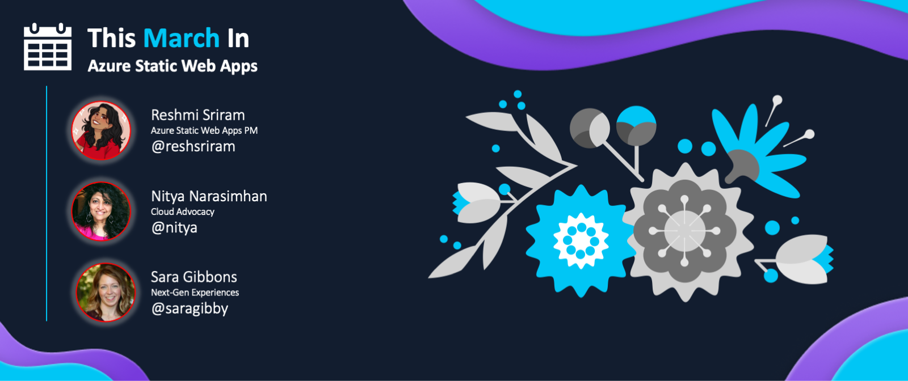
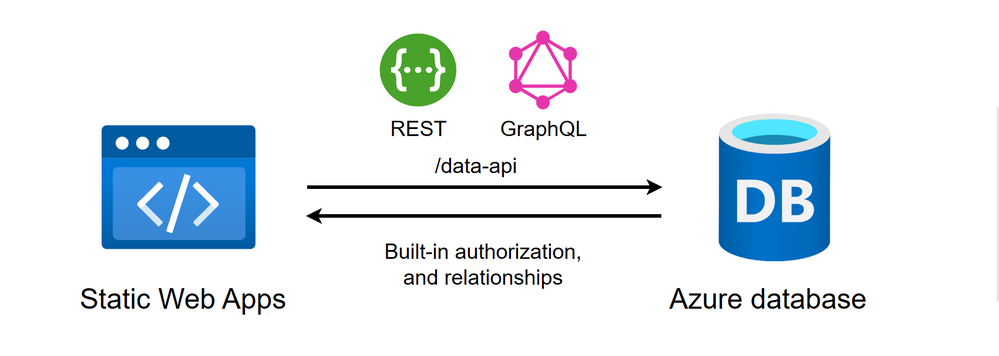

<head>
  <meta name="twitter:url" content="https://www.azurestaticwebapps.dev/blog/roundup-2023-mar" />
  <meta name="twitter:title" content="This Month in Azure Static Web Apps: March 2023" />
  <meta name="twitter:description" content="This March in @AzureStaticApps - we cover Azure Static Web Apps Diagnostics, authentication, deploying from Codespaces and SWA CLI" />
  <meta name="twitter:image" content="https://www.azurestaticwebapps.dev/img/png/roundup/mar.png" />
  <meta name="twitter:card" content="summary_large_image" />
  <meta name="twitter:creator" content="@saragibby" />
  <meta name="twitter:site" content="@AzureStaticApps" /> 
  <link rel="canonical" href="https://www.azurestaticwebapps.dev/thismonth/roundup-2023-mar" />
</head>

Welcome to the **March 2023** edition of **This Month in SWA** 🎉

:::info ABOUT THE ROUNDUP 

The roundup is traditionally published **on the fourth Monday of each month** - just ahead of the [**Azure Static Web Apps Community Standup**](https://aka.ms/swa/community/standups) held on the fourth Thursday of each month. Catch up on all the news and announcements in one friendly blog post, then join the livestream for interactive discussions, demos and more.

 * Want to make sure you don't miss the next roundup? <a href="/thismonth/rss.xml" target="_blank">**Subscribe to the feed**</a>.
 * Want to contribute items for roundup? [**Submit this custom issue**](https://github.com/staticwebdev/30DaysOfSWA/issues/new?assignees=&labels=ThisMonthIn+-+Community&template=---this-month-in-swa--community-submission.md&title=This+Month+In%3A+Community).
 * Want to catch up on past posts? [**Browse past editions.**](/roundup#roundups-archive)
 * Want to catch up on past livestreams? [**Watch standup recordings**](https://aka.ms/swa/community/standups)

And don't forget to contribute _your_ updates for inclusion in the next issue!

:::

---

---

## Product News

_This section covers recent news or announcements from the product team. Read on to learn the latest news from the world of Azure Static Web Apps!_ 

> 🌟 **Database Connections** now available! 🌟 
> Find all the resources in our [Database Connections: Content Collection](/collections/dab)

* **March 15** | [Public preview: Azure Static Web Apps support for A Record](https://azure.microsoft.com/en-us/updates/public-preview-azure-static-web-apps-support-for-a-record/) Azure Static Web Apps introduces the ability to add an APEX custom domain with an `A` record to enable the use of domain registrars that do not support `ALIAS` record, `ANAME` record and `CNAME` flattening. | _**[Read More For Details!](https://aka.ms/swa/arecords)**_
* **March 15** | [Public preview: Database connections support in Azure Static Web Apps](https://azure.microsoft.com/en-us/updates/public-preview-database-connections-support-in-azure-static-web-apps/) Azure Static Web Apps introduces database connections with Data API Builder. Now, you can access your Azure database content directly from your frontend client application, without the need to write backend code. Make REST and GraphQL requests to the built-in `/data-api` endpoint to securely retrieve and modify your database contents. | _**[Learn more and get started today!](https://aka.ms/swa/database-connections)**_
* **March 15** | [Public preview: Data API builder instantly creates modern REST and GraphQL endpoints for modern databases](https://azure.microsoft.com/en-us/updates/public-preview-data-api-builder-instantly-creates-modern-rest-and-graphql-endpoints-for-modern-databases/) With data API builder, database objects can be exposed via REST or GraphQL endpoints so that your data can be accessed using modern techniques on any platform, any language, and any device. | _**[Data API builder is available as an Open-Source project here](https://aka.ms/dab)**_

---

## Dev Resources

_This section covers content, events and code samples from Microsoft authors. Check them out for relevant learning resources and best practices._

* **March 07** | `techcommunity.microsoft.com` - [**Azure function app doesn't work after unlinking to Azure static web app**](https://techcommunity.microsoft.com/t5/apps-on-azure-blog/azure-function-app-doesn-t-work-after-unlinking-to-azure-static/ba-p/3759599) by _Tony Ju_. Linking an existing Azure function app to an Azure static web app will map the function to the /api route of your static web app, but when then accessing the function app outside your static web app, you get an error. Follow this walk through on how to update your function's authentication settings to get working for both scenarios.
* **March 16** | `youtube.com` - [**Connect to a Database directly from Static Web Apps**](https://youtu.be/vGOnh0UrADg) by _Thomas Gauvin_. Discover how to connect your Azure SQL Database to your Static Web Apps, and access it through a secure data endpoint generated for you. This video shows how to setup the connection, and use the REST API to perform Create, Read, Update and Delete (CRUD) operation on your data.
* **March 16** | `youtube.com` -  [**Query a Database using GraphQL from your Static Web Apps**](https://youtu.be/NF0EC68rdQk) by _Craig Shoemaker_. Learn how to query your Database directly through your Static Web Apps using GraphQL, without having to write any backend code with Azure Static Web Apps database connections feature. This video shows how to setup and use the database connection feature to use GraphQL queries in your apps.
* **March 16** | `techcommunity.microsoft.com` - [**GraphQL on Azure: Part 13 - Using Data API builder with SWA and React**](https://techcommunity.microsoft.com/t5/apps-on-azure-blog/graphql-on-azure-part-13-using-data-api-builder-with-swa-and/ba-p/3769309) by _Aaron Powell_. Follow along in this walkthrough on how you can create your own React application that uses GraphQL to fetch data from a Cosmos DB database using Database Connections! 

---

## Community Buzz

:::info AUTHORED BY DEVS LIKE YOU!
_This section highlights content from our amazing developer community - submitted directly, or discovered via the Azure Static Web Apps tag in sites like Tech Community and dev.to._
:::

* **March 13** | `dev.to` - [**Astro and Azure Static Web Apps**](https://dev.to/florianrappl/astro-and-azure-static-web-apps-efl) by _Florian Rappl_ In this article what Astro is, and why it is ideal for an information driven static website. Then dive into Azure SWA as a hosting candidate, and what you might want to consider when going there, and how to deploy your Astro site.
* **March 10** | `geeksforgeeks.org` -  [**How to use Azure Static Web Apps to Deploy an Angular App**](https://www.geeksforgeeks.org/how-to-use-azure-static-web-apps-to-deploy-an-angular-app/) by _Manikandan Shanmugam_ Follow this step by step guide on how you can create and deploy your own Angular app to Azure Static Web Apps with having just a GitHub and an Azure account.
* **March 20** | `blog.johnnyreilly.com` -  [**Playwright, GitHub Actions and Azure Static Web Apps staging environments**](https://blog.johnnyreilly.com/playwright-github-actions-and-azure-static-web-apps-staging-environments) by _John Reilly_ Azure Static Web Apps staging environments allow you to test changes before they go live. This post shows how to use Playwright against staging environments with GitHub Actions. 

---

## Upcoming Events

_This section highlights in-person or online events that are likely to feature Azure Static Web Apps content or developer conversations - links to CFPs or registration links are welcome!_

* **March 23** | ✨ **Join LIVE for [Azure Static Web Apps Community Standups](https://www.youtube.com/live/9O4qZ6VHOIA?feature=share)** ✨ Meet members of the Azure Static Web Apps team as they cover the latest news, demos and announcements in a livestreamed event (12pm EST).
* **March 20-24** | [**Microsoft Student Summit**](https://aka.ms/StudentSummit) Register for free for this 90 min career focused event! Watch live or on-demand after event, and stay tuned for post-Summit skilling activities in your region.
* **April 5** | [**Azure Developers - .NET Day**](https://learn.microsoft.com/events/learn-events/azuredeveloper-dotnetday/) Join us to discover the latest services and features in Azure designed specifically for .NET developers. You'll learn cutting-edge cloud development techniques that can save you time and money, while providing your customers with the best experience possible.
* **April 26** | [**VS Code Day 2023**](https://learn.microsoft.com/events/learn-events/vs-code-day-2023/) Our annual event where you'll learn how to elevate your development workflow using the latest and greatest features of VS Code.
* **May 23-24** | [**Microsoft Build**](https://build.microsoft.com/home) Advance your knowledge and skills with deep interactive sessions focused on cloud and AI, .NET, data and analytics, dev tools, DevSecOps and SRE, low-code, and more. [Register now](https://register.build.microsoft.com/) to attend the event live in Seattle or remote from anywhere in the world.

---

## Did You Know?

_Each month, we hope to turn the spotlight on one key resource or person that is worth knowing about, in the context of Azure Static Web Apps._

:::info 🌟 SPOTLIGHT ON:  DATABASE CONNECTIONS

Last week we annonced the release of [**Database Connections for Azure Static Web Apps**](https://aka.ms/swa/db/announcement) 🥳

This new feature allows you to access Azure databases using REST and GraphQL, without writing backend code! Once you create a connection between your web application and database, you can manipulate data with full support for CRUD operations, built-in authorization, and relationships.

:::

Ready to learn more? We've got you covered! The site is now updated with _Collections_ where you can find links to recoures for lots of topics. Check out our [**Database Connections: Content Collection**](../collections/dab) with all you'll need on database connections. 

Or, here's some links for you to get your database connection going now:
* [Get started for free by connecting a database to your Static Web Apps resource](https://aka.ms/swa/db/getstarted)
* [Learn more about Database connections for Static Web Apps](https://aka.ms/swa/db/docs)

As you have feedback and ideas, we'd love to hear it! Join the [**GitHub Database Connection Discussion**](https://github.com/Azure/static-web-apps/discussions/1111) to share with us.

---

## 🚨 | Call For Content

:::tip Next Roundup: April 24, 2023
Submissions welcome till April 19, 2023.

 * Did you author an article, create a SWA application or sample?
 * Are you organizing an event with a SWA-related session?
 * Are you a student who just created your first SWA app or blog post?

Submit the details [**using this custom issue**](https://github.com/staticwebdev/30DaysOfSWA/issues/new?assignees=&labels=ThisMonthIn+-+Community&template=---this-month-in-swa--community-submission.md&title=This+Month+In%3A+Community) as soon as possible. We can't wait to share your contributions!
:::
