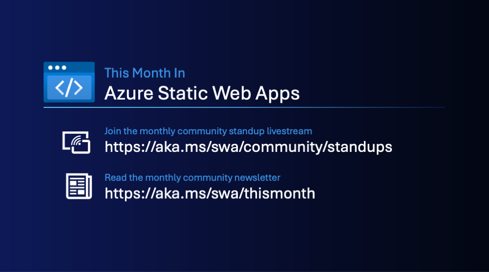
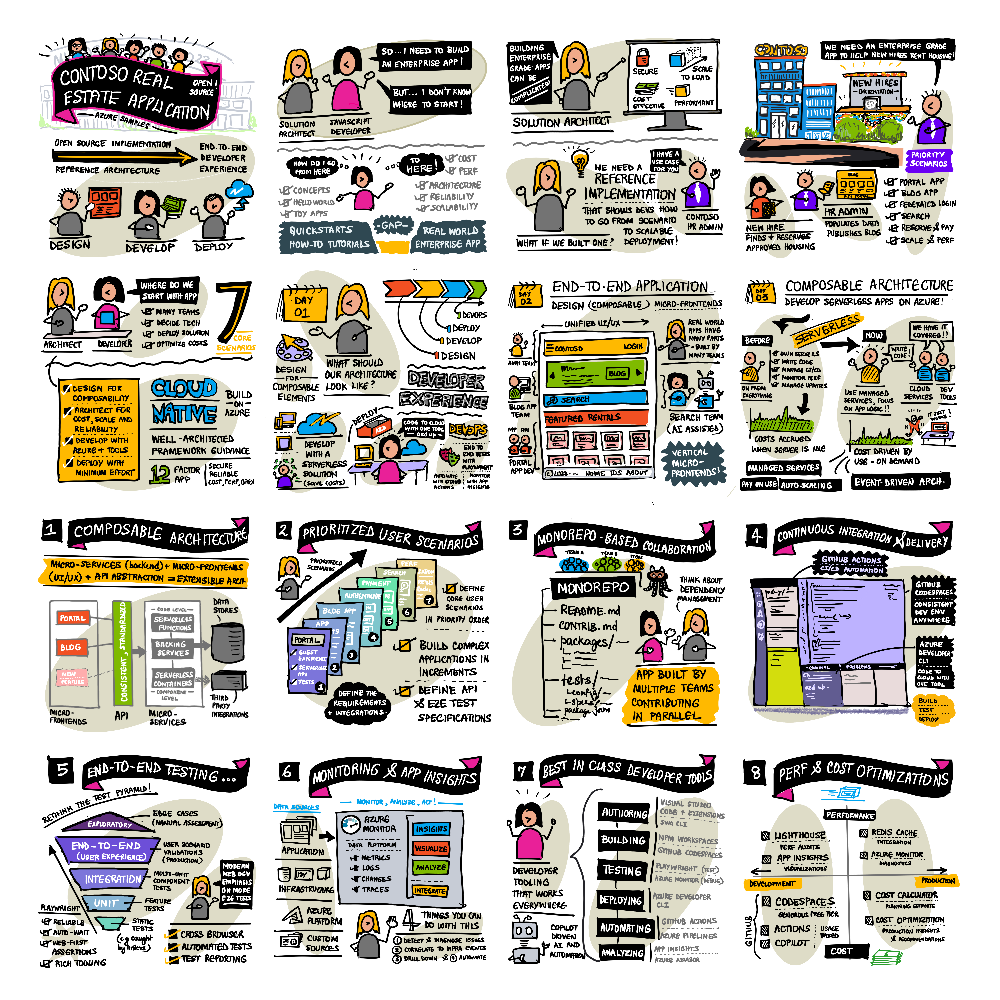

<head>
  <meta name="twitter:url" content="https://www.azurestaticwebapps.dev/blog/roundup-2023-jul" />
  <meta name="twitter:title" content="This Month in Azure Static Web Apps: Jul 2023" />
  <meta name="twitter:description" content="This Month in @AzureStaticApps - join us and catch up on the latest news, demos, announcements and community content for Azure Static Web Apps!" />
  <meta name="twitter:image" content="https://www.azurestaticwebapps.dev/img/png/roundup/tmis-banner.png" />
  <meta name="twitter:card" content="summary_large_image" />
  <meta name="twitter:creator" content="@nitya" />
  <meta name="twitter:site" content="@AzureStaticApps" /> 
  <link rel="canonical" href="https://techcommunity.microsoft.com/t5/apps-on-azure-blog/this-month-in-azure-static-web-apps-july-2023/ba-p/3883710" />
</head>

:::info WELCOME TO THIS MONTH'S NEWSLETTER

We round up the latest news, product announcements, content and community highlights – in one compact post. Missed an episode or post? We have you covered! 
 - View the blog archives: **https://aka.ms/swa/thismonth**  
 - View the livestream replays: **https://aka.ms/swa/community/standups** 
 - Subscribe to the blog feed: **https://aka.ms/swa/thismonth/rss.xml**

We love our community and want to hear from you!!
 - Want to contribute resource links? [**Submit this custom issue**](https://github.com/staticwebdev/30DaysOfSWA/issues/new?assignees=&labels=ThisMonthIn+-+Community&template=---this-month-in-swa--community-submission.md&title=This+Month+In%3A+Community).
 - Want to chat with us? [**Join the monthly standup live**](https://aka.ms/swa/community/standups)
:::
---

## Community Standup

The Community Standups livestream happens on the last Thursday of each month. Join us for the next one on **Jul 27, 2023** for some interactive demo and discussions. This month we’ll walk through adding backend functionality to your single-page app using Azure Functions. Check out the video archives for more exciting demos and guests! 

> Join us **live @9am PST / 12pm EST / 5pm GMT** or catch up on the replay later.
<iframe width="800" height="480" src="https://www.youtube.com/embed/fZljYaqGPy0" title="Azure Static Web Apps Community Standup - Beyond the frontend with Static Web Apps &amp; Azure Functions" frameborder="0" allowfullscreen></iframe>

---

## Monthly Roundup

Let's start with **Community Highlights** 

### Community: Blogs 

- Azure Static Web Apps, Next.js and Azure DevOps (Japanese) - Jul 5 
- Use preview environments for testing SWA – Jul 11 
- Deploying with SWA is even faster with new HTML preset – Jul 17 

### Community: Videos

- Build & Deploy SWA (Angular, Azure Functions, ALM & DevOps) - July
- Azure Static Web Apps with Blazor and .NET (NDC Oslo) - July 
Burke Learns Blazor – June
- Connect your SWA to Azure Databases using REST or GraphQL - June

### Community: Events

- [Hack Together: The JavaScript On Azure Global Hack](https://developer.microsoft.com/en-us/reactor/series/S-1173/) - Join students, beginners and experienced developers worldwide for this 2-week virtual hack experience on a learning journey to build enterprise-grade applications like the Contoso Real Estate app above. Aug 16-Aug 31. 
- [Azure Static Web Apps Community Standup](https://www.youtube.com/watch?v=fZljYaqGPy0&list=PLI7iePan8aH4AiiQ6UejZ4lxmbK3QX4Dy&index=6) – joins us for the latest news, interactive demos and discussions on Azure Static Web Apps. Livestreamed on YouTube. Jul 27. 

---

## Spotlight On ..

_Each month, we hope to turn the spotlight on one key resource or person that is worth knowing about, in the context of Azure Static Web Apps._

:::info 🌟 SPOTLIGHT ON:  CONTOSO REAL ESTATE APP REFERENCE SAMPLE

Did you know we released an [open-source enterprise-grade application](https://aka.ms/contoso-real-estate-github) at Microsoft Build that showcases a composable architecture using technologies like Azure Static Web Apps, Azure Functions, Azure Cosmos DB and more? 

:::

If you missed attending that session, we have some resources for you to explore on your own.

### Architecture

### Teaser Video
Get a sneak peek at what you will build
<iframe width="800" height="480" src="https://www.youtube.com/embed/GxeENsvwZrI" title="Contoso Real Estate Teaser" frameborder="0" allowfullscreen></iframe>

### Illustrated Guide

Want to get a sense of why we built the application, and what you will learn? Here's a visual overview. You can view or download a [**hi-res version of the image**](https://github.com/SketchTheDocs/cloud-skills/blob/main/gallery/MSBuild-2023-ContosoRealEstate.png) for a closer look. 

### 🚨 | Call To Action!

- Read the [launch announcement](https://techcommunity.microsoft.com/t5/apps-on-azure-blog/announcing-contoso-real-estate-javascript-composable-application/ba-p/3827097) post. 
- Fork the [open-source repo](https://aka.ms/contoso-real-estate-github?source=techcommunity) and explore it! (Give us a star if you like it!) 
- Join a [live coding series](https://www.youtube.com/playlist?list=PLb2HQ45KP0Wu6g_B-QJrvWOe8RdNCmio2) exploring the codebase for refactoring (Portuguese) 

And keep an eye on the [Microsoft Learn](https://learn.microsoft.com/en-us/azure/developer/javascript/composable-cloud-contoso-real-estate) documentation site for more updates.