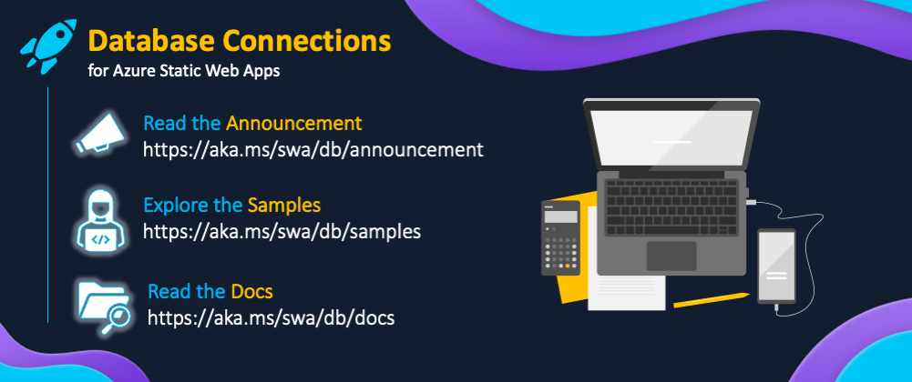

<head>
  <meta name="twitter:url"
    content="https://www.azurestaticwebapps.dev/collections/dab" />
  <meta name="twitter:title"
    content="Database Connections For Azure Static Web Apps" />
  <meta name="twitter:description"
    content="Seamlessly connect your Azure Static Web App to Azure Databases without writing backend code, using the new Database Connections feature. Learn more at https://aka.ms/swa/collections/dab" />
  <meta name="twitter:image"
    content="https://azurestaticwebapps.dev/img/collections/swa-dab-launch.png" />
  <meta name="twitter:card" content="summary_large_image" />
  <meta name="twitter:creator"
    content="@nitya" />
  <meta name="twitter:site" content="@AzureStaticApps" />
  <link rel="canonical"
    href="https://www.azurestaticwebapps.dev/collections/dab" />
</head>

# Database Connections: Content Collection

Modern web applications rely on scalable and cost-effective access to databases from their front-end experiences. Implementing the backend services to handle data interactions can be complex and repetitive. Wouldn't it be great if we could seamlessly access Azure databases using REST and GraphQL, without writing backend code?

Now, you can! Join us for a week of exploration related to _Database Connections For Azure Static Web Apps_ - **check back daily for a new resource to help you learn more about this feature!**

---

## 1. Launch Announcement

:::tip WE VALUE YOUR FEEDBACK!
We want to keep improving this feature, and the Azure Static Web Apps developer experience, to meet your needs. **Your feedback matters!** so please leave us comments and questions at the link below!

💬 | [**Contribute to the discussion!**](https://github.com/Azure/static-web-apps/discussions/1111)
:::

On Mar 15 (today) we announced "database connections for Azure Static Web Apps", an easy way to access your Azure database content from your front-end static app with REST and GraphQL, without having to write any backend code. Get started for free during public preview.
 * [Read the Announcement Post](https://aka.ms/swa/db/announcement)
 * [Explore the Azure Samples](https://aka.ms/swa/db/samples)
 * [Explore the Documentation](https://aka.ms/swa/db/docs)

We also have SWA CLI updates to share:
 * [Database Connections now supported](https://www.npmjs.com/package/@azure/static-web-apps-cli)
 * [SWA CLI Referennce Documentation](https://learn.microsoft.com/azure/static-web-apps/static-web-apps-cli)

Starting tomorrow, we hope to share more resources to help you dive into the topic - from video walkthroughs to articles on best practices, and tutorials illustrating usage with different frameworks and usage scenarios.

---

## 2. Azure Tips & Tricks

:::success DIVE INTO: DATABASE CONNECTIONS (2-part video)
_Azure Static Web Apps Tips and Tricks_ is a video series that walks through the various features of Azure Static Web Apps, one episode at a time. | _Watch Past Episodes_ on [**Microsoft Learn**](https://learn.microsoft.com/shows/azure-tips-and-tricks-static-web-apps/) or [**YouTube**](https://aka/ms/StaticWebAppsTips/)

:::

Today, we're debuting 2 new episodes focused on Database Connections. 
1. ✨ **Connect to a Database from Static Web Apps using a REST API** -  Join Thomas Gauvin for this video tutorial showing you how to connect your Azure SQL Database to your Static Web Apps, and access it through a secure data endpoint generated for you, using the REST API.
    <iframe width="800" height="420" src="https://www.youtube.com/embed/vGOnh0UrADg" title="Connect to a Database directly from Static Web Apps [Part 21] | Azure Tips and Tricks" allowfullscreen></iframe>

2. ✨ **Query a Database from your Static Web Apps using a GraphQL API** - Join Craig Shoemaker and learn how to query the database using a GraphQL endpoint. 
    <iframe width="800" height="420"  src="https://www.youtube.com/embed/NF0EC68rdQk?list=PLlrxD0HtieHgMPeBaDQFx9yNuFxx6S1VG" title="Query a Database using GraphQL from your Static Web Apps [Part 22] | Azure Tips and Tricks" allowfullscreen></iframe>

---

## 3. Blazor SWA + GraphQL

:::success DIVE INTO: GRAPHQL ON AZURE
_Database Connections_ can support both REST and GraphQL endpoints for access. Want to explore GraphQL on Azure? Check out [**this ongoing series of posts**](https://www.aaron-powell.com/posts/2020-07-13-graphql-on-azure-part-1-getting-started/) from Microsoft Cloud Advocate [Aaron Powell](https://github.com/aaronpowell).
:::

Today, Aaron is sharing 3 new posts in the series that provide more hands-on learning for using Database Connections in your modern web app.

1. [**Part 12: GraphQL as a Service**](https://techcommunity.microsoft.com/t5/apps-on-azure-blog/graphql-on-azure-part-12-graphql-as-a-service/ba-p/3769306) provides an introduction to the new[Data API Builder for Azure Databases](https://aka.ms/dabdocs)(*DAB*) - currently in public preview - the underlying technology that provides an easy way to create REST or GraphQL endpoints to your existing Azure database without you having to write backend code.
2. [**Part 13: Using Data API builder with Azure Static Web Apps**](https://techcommunity.microsoft.com/t5/apps-on-azure-blog/graphql-on-azure-part-13-using-data-api-builder-with-swa-and/ba-p/3769309) - next, take a look at how the DAB capability can be accessed seamlessly in your Azure Static Web App using the new [Database Connections](https://aka.ms/swa/db/announcement) feature and a React app example. (_Note_: Another [**upcoming post**](collections/dab#4-coming-soon-tutorial) in this collection will walk through the official React sample for SWA+DAB so stay tuned).
3. [**Part 14: Using Data API builder with SWA and Blazor**](https://techcommunity.microsoft.com/t5/apps-on-azure-blog/graphql-on-azure-part-14-using-data-api-builder-with-swa-and/ba-p/3769316) Today, we want to feature this post which implements the same use case - the Trivia game shown below - as a **Blazor application** using the [Strawberry Shake NuGet package](https://chillicream.com/docs/strawberryshake/v13/get-started). | 👉🏽 **[Explore the source](https://github.com/aaronpowell/dab-blazor-trivia-demo)**

---

## 4. Vue, React, Angular

:::success BOOKMARK: AZURE SAMPLES FOR DATA API BUILDER
The Azure Static Web Apps Database Connections feature uses the [Data API builder for Azure Databases](https://github.com/Azure/data-api-builder) to support REST and GraphQL endpoints for your deployed app. The [Azure-Samples/data-api-builder](https://github.com/Azure-Samples/data-api-builder) is a good resource to discover and explore _end-to-end_ samples using this feature. 
:::

Here are three samples showcasing Static Web Apps Database Connections:
 1. [**Vue + AzureSQL**](https://github.com/Azure-Samples/dab-swa-todo) - The well-known ToDo MVC application, built using Database connections and SWA.
 2. [**React + AzureSQL**](https://github.com/Azure-Samples/dab-swa-library-demo) - Organize track books with this sample app, built using Database connections and SWA.
 3. [**Angular + CosmosDB (NoSQL)**](https://github.com/Azure-Samples/dab-swa-wonders) - Tour world wonders in this app, built using Database connections and SWA.

---

## 5. Learn Best Practices

:::success BEST PRACTICES FOR USING DATABASE CONNECTIONS 

Want to connect your Azure Static Web Apps to your database? Should you use Azure Functions with a managed, serverless API interface? Or use Data API builder directly? Or use the new Database Connections feature in SWA that wraps it? _Let's learn about best practices_ when taking the decision.
:::

Today, we are sharing a new blog post from Static Web Apps PM Thomas Gauvin, that looks at this particular question. In particular, it helps you understand the choices between using Azure Functions (managed), Data API builder (direct) or Database Connections (seamless) options to connect your Azure Static Web App to your database.
 
* **[Read the Article](https://techcommunity.microsoft.com/t5/apps-on-azure-blog/building-static-web-apps-with-database-connections-best/ba-p/3777155)** 
* [**View Older Posts**](https://techcommunity.microsoft.com/t5/apps-on-azure-blog/bg-p/AppsonAzureBlog/label-name/Static%20Web%20Apps)

But wait, there's more! Check out the recent [Azure SWA Community Standups](https://aka.ms/swa/community/standups) recording where Davide Mauri (Data API Builder PM) and Thomas Gauvin (SWA PM) discuss the new Database Connections feature and how it works - with more insights into best practices and usage.

<iframe width="800" height="420" src="https://www.youtube.com/embed/9O4qZ6VHOIA?list=PLI7iePan8aH4AiiQ6UejZ4lxmbK3QX4Dy" title="Database connections | Azure Static Web Apps Community Standup" allowfullscreen></iframe>

---

## 6. Coming Soon: (Tutorial)

:::info Tutorial: SVELTE APP + AZURE COSMOSDB
Svelte is an increasingly popular framework for building modern web apps. In this post, we'll walk through a code sample using Svelte + Azure CosmosDB with a practical use case. | [**View Older Posts > Apps On Azure**](https://techcommunity.microsoft.com/t5/apps-on-azure-blog/bg-p/AppsonAzureBlog/label-name/Static%20Web%20Apps)

⏸ | Revisit the page on Mar 31 for updates.

:::

---

## 7. Coming Soon: (Article)

:::info WRAP-UP: RESOURCES & NEXT STEPS
This brings us to the end of launch week but our learning journey will continue. In this post, we'll share useful resources for self-study and give a sneak peek at planned future posts for this collection. | [**View Older Posts > Apps On Azure**](https://techcommunity.microsoft.com/t5/apps-on-azure-blog/bg-p/AppsonAzureBlog/label-name/Static%20Web%20Apps)

⏸ | Revisit the page on Mar 31 for updates.

:::

---
