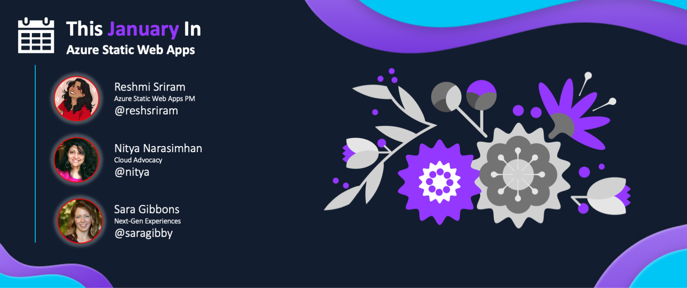

## Monthly Standup 🆕

:::info JOIN THE MONTHLY COMMUNITY STANDUP!

Did you know the Azure Static Web Apps Team now hosts a monthly standup for the community on the **last Thursday** of each month? Join members of the Azure Static Web Apps team and their special guests as they cover key announcements and topics **LIVE!** and take your questions on chat! 

🔗 [**https://aka.ms/swa/community/standups**](https://aka.ms/swa/community/standups)
:::

**Watch the replay from the last standup**

<iframe width="640" height="360" src="https://www.youtube.com/embed/7hTQJs9Ku5Y?list=PLI7iePan8aH7Yo8vo288dAULgjyCCCcEJ&t=166" title="Welcome to Azure Static Web Apps Community Standups" frameborder="0" allowfullscreen></iframe>

---

## Monthly Roundup

Welcome to `This Month In SWA` - a monthly roundup of [Azure Static Web Apps](https://docs.microsoft.com/en-us/azure/static-web-apps/overview) news and updates from the Product Team, Cloud & Student Advocacy - and from you, our amazing Developer Community.  

[**Click here to read the latest issue**
](/blog/roundup-2023-jan)

---

## Roundups Archive

We'll keep this section updated with links to the monthly roundup posts, once they've been published.

 * **Issue #01**: [Aug 2022](https://www.azurestaticwebapps.dev/thismonth/roundup-2022-aug)
 * **Issue #02**: [Sep 2022](https://www.azurestaticwebapps.dev/thismonth/roundup-2022-sep)
 * **Issue #03**: [Oct 2022](https://www.azurestaticwebapps.dev/thismonth/roundup-2022-oct)
 * **Issue #04**: [Nov 2022](https://www.azurestaticwebapps.dev/thismonth/roundup-2022-nov)
 * **Issue #05**: Holiday Break! 🥳 
 * **Issue #06**: [Jan 2023](https://www.azurestaticwebapps.dev/thismonth/roundup-2023-jan)

> Upcoming editions 

 * **Issue #07**: [Feb 2023](https://www.azurestaticwebapps.dev/thismonth/roundup-2023-feb)
 * **Issue #08**: Mar 2023
 * **Issue #09**: Apr 2023
 * **Issue #10**: May 2023
 * **Issue #11**: Jun 2023
 * **Issue #12**: Jul 2023

---

## Call For Contributions

**Have you built something recently you want to share**?  Use  [the custom issue](https://github.com/staticwebdev/30DaysOfSWA/issues/new/choose) to submit your news, articles, or events, for consideration this month, or in future issues.

* Next Publication Date: **February 20, 2023** 
* Contribution Deadline: **February 15, 2023**

---

## Why This Roundup?

Since we concluded the [#30DaysOfSWA](roadmap) series in May/June 2022, we've noticed many of you continuing to visit this site for updates. At the same time, we've seen new posts published on the [#staticwebapps tag on dev.to](https://dev.to/t/staticwebapps) and on [Tech Community](https://techcommunity.microsoft.com/t5/apps-on-azure-blog/bg-p/AppsonAzureBlog/label-name/Static%20Web%20Apps) blogs. And we've seen learning events shared [via tweets @AzureStaticApps](https://twitter.com/AzureStaticApps) that many of you may not be aware of. 

So we thought - why not _round up_ all the SWA news and activities each month, and make them available in a single post for convenient reading. The result: **This Month In SWA** - a blog post that we will publish on the last Wednesday of each month. The kind of content we hope to feature includes:

 * 🗓 | ** Events**: Past and Upcoming, featuring SWA talks or training opportunities.
 * 📢 | **Announcements**: Latest news or updates from the Product and Engineering teams.
 * 👀 | **Content Updates**: New articles, tutorials or samples authored by Microsoft developers.
 * 🐝 | **Community Buzz**: New articles, tutorials or samples authored by Community developers 
 * 🌟 | **Spotlight**: Featuring a project or person that makes a difference to SWA developers.

---

## How to Contribute?

Want to contribute content to our roundups? 

 * Just [submit this custom issue](https://github.com/staticwebdev/30DaysOfSWA/issues/new?assignees=&labels=ThisMonthIn+-+Community&template=---this-month-in-swa--community-submission.md&title=This+Month+In%3A+Community) with a link to your event, code project or content.
 * Feel free to share the issue with others for upvotes
 * We review submissions the week prior to publication
 * Accepted submissions will be tagged with link to post (and issue will be closed)

