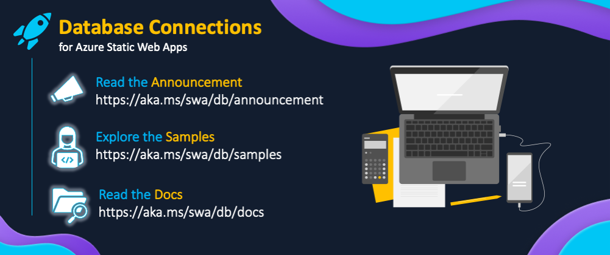

## 💬 | Monthly Standup 

:::info | JOIN THE MONTHLY COMMUNITY STANDUP!

Did you know the Azure Static Web Apps Team now hosts a monthly standup for the community on the **last Thursday** of each month? Join members of the Azure Static Web Apps team and their special guests as they cover key announcements and topics **LIVE!** and take your questions on chat! 

🔗 [**https://aka.ms/swa/community/standups**](https://aka.ms/swa/community/standups)
:::

**Watch the replay from the last standup**

<iframe width="800" height="400" src="https://www.youtube.com/embed/cCyH4ydtElY?t=176" title="Welcome to Azure Static Web Apps Community Standups" frameborder="0" allowfullscreen></iframe>

---

## 🗓 | Monthly Roundup

:::info Lets talk about #ThisMonthInSWA

Welcome to **This Month In SWA** - a monthly roundup of [Azure Static Web Apps](https://docs.microsoft.com/azure/static-web-apps/overview) news and updates from the Product Team, Cloud & Student Advocacy - and from you, our amazing Developer Community. 
 * Visit [**#ThisMonthInSWA**](/thismonth) to view past issues.
 * Subscribe to the [**RSS Feed**](/thismonth/rss.xml) to get new issues directly!
:::

When we wrapped the [#30DaysOfSWA](roadmap) series in June 2022, we many of you continuing to stop by the site for content updates. There are many resources you can track individually:
 * Follow the [**#staticwebapps tag on dev.to**](https://dev.to/t/staticwebapps) for community posts
 * Follow the [**StaticWebApps topic on TechCommunity**](https://techcommunity.microsoft.com/t5/apps-on-azure-blog/bg-p/AppsonAzureBlog/label-name/Static%20Web%20Apps) for product team and advocacy posts
 * Follow the [**@AzureStaticApps handle on Twitter**](https://twitter.com/AzureStaticApps) for news on upcoming events & announcements

But we thought it might help if we had a _round up_ of all the key news and content updates in a single montly post for convenient reading. That's the origin story for **#ThisMonthInSWA**. We hope to cover:

 * 🗓 | ** Events**: Past and Upcoming, featuring SWA talks or training opportunities.
 * 📢 | **Announcements**: Latest news or updates from the Product and Engineering teams.
 * 👀 | **Content Updates**: New articles, tutorials or samples authored by Microsoft developers.
 * 🐝 | **Community Buzz**: New articles, tutorials or samples authored by Community developers 
 * 🌟 | **Spotlight**: Featuring a project or person that makes a difference to SWA developers.

[**Click here to read the latest issue**
](/thismonth/roundup-2023-feb)

---

##  🚀 | Content Collections 

:::info 🆕 LEARN WITH CONTENT COLLECTIONS

Welcome to **[Content Collections](/collections)** - a new feature on this site that bundles a relevant set of posts or resources into a short collection that can help you skill up on a specific topic!
 * Bookmark [**the collections page**](/collections) and revisit it for updates
 * We will _spotlight_ new collections on #ThisMonthInSWA so [**subscribe to the RSS Feed**](https://www.azurestaticwebapps.dev/thismonth/rss.xml)
:::

When we created the [#30DaysOfSWA](roadmap) series, we deliberately designed a content plan with _themed weeks_ focused on a specific topic. Now, we are packaging these into **collections** - short content bundles that provide a deep dive into a particular topic or theme, that you can reuse, refer to, or compose into custom roadmaps.

We also realized this was a good way to provide a comprehensive _content bundle_ to skill you up on new features on their debut - giving you a way to go from the launch announcement, to the documentation, to new tutorials and video resources that enhance your understanding.

[**Click here for the latest collection on: Database Connections** ](/collections/dab)

---

## 📣 | Call For Contributions

**Have you built something recently you want to share**?  Use  [**the custom issue**](https://github.com/staticwebdev/30DaysOfSWA/issues/new/choose) to submit your news, articles, or events, for consideration this month, or in future issues. We typically review submissions received at least 3 days ahead of our publication date. Accepted contributions may be published in the next roundup, or in a future roundup (if time or space constraints factor in).

* Roundup Post: **Last Monday each month** 
* Standup Livestream: **Last Thursday each month.**

---
